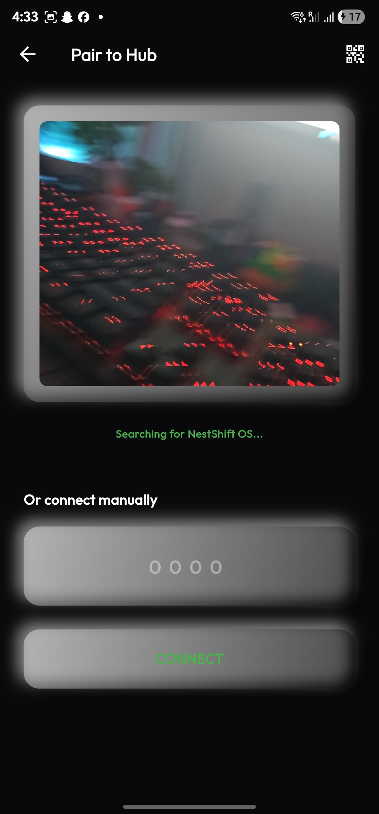
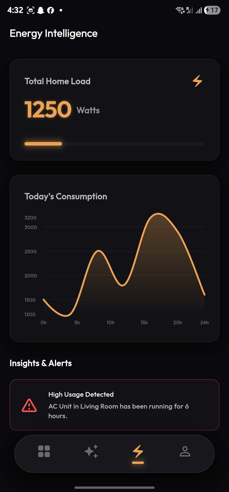
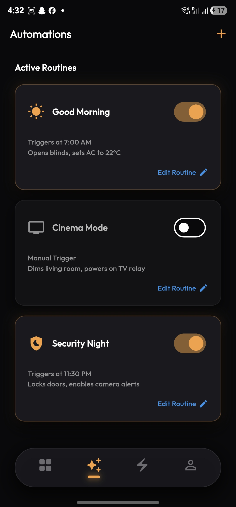
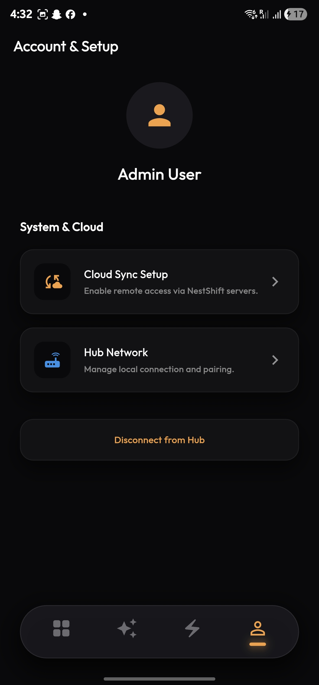
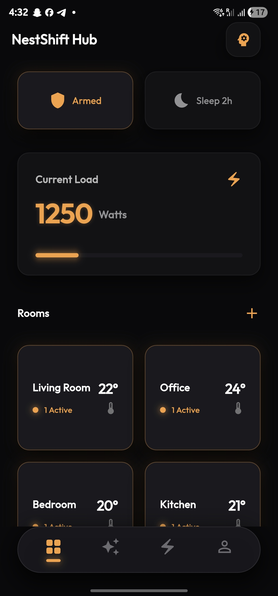

# NestShift Smart Home

<p align="center">
  
  
  
  
  
</p>

**NestShift** is a production-grade, local-first intelligent home controller built with Flutter. Designed with a sleek, hardware-centric, and privacy-first architectural approach, this app acts as the central hub for the NestShift OS ecosystem.

## ✨ Features

- **Local-First Architecture:** Pairs directly with your NestShift OS (Raspberry Pi/Local Hub) via local IP and WebSockets, ensuring zero reliance on centralized cloud servers by default.
- **Premium Design System:** A finely crafted, minimalist dark aesthetic with high-contrast amber/gold accents (simulating LED indicators and modern hardware panels).
- **Energy Intelligence:** Real-time energy monitoring, consumption analytics via dynamic charts, and automated high-load alerts.
- **Advanced Automations:** Granular, routine-based customization for lights, climate, and security.
- **AI Voice Integration:** Deeply integrated conversational AI designed for smart, hands-free home control.

## 🚀 Getting Started

Ensure you have Flutter installed on your machine.

### Prerequisites
- Flutter SDK (latest stable)
- Dart SDK

### Installation

1. Clone the repository:
```bash
git clone https://github.com/aryan597/nest-shift-app.git
```

2. Navigate into the project directory:
```bash
cd nest-shift-app/nestshift_flutter
```

3. Install dependencies:
```bash
flutter pub get
```

4. Run the app:
```bash
flutter run
```

### 🔗 Connecting to NestShift OS
- Launch the app and tap **Setup Hardware**.
- Scan the QR code generated by the NestShift OS instance running on your Raspberry Pi.
- Alternatively, for local testing, enter the PIN `0000` to boot the app into **Dummy Data Mode** and explore the UI!

## 🛠 Tech Stack
- **Framework:** Flutter (Dart)
- **State Management:** Riverpod (`flutter_riverpod`)
- **Routing:** GoRouter (`go_router`)
- **Data & Networking:** Dio, WebSockets (`web_socket_channel`)
- **Sensors:** Mobile Scanner (`mobile_scanner`)
- **Charts:** FL Chart (`fl_chart`)

---
*Built for the privacy-centric home of tomorrow.*
